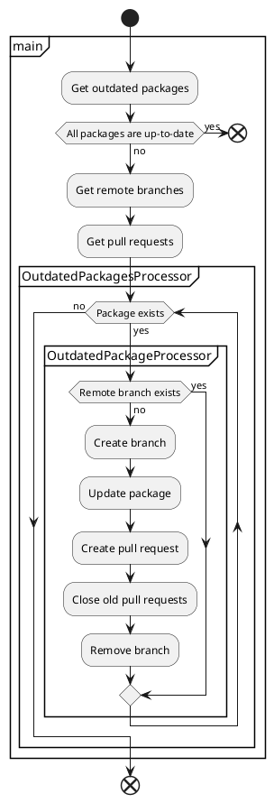

[](https://badge.fury.io/js/npm-update-package)
[](https://standardjs.com)

# npm-update-package

CLI tool for creating pull request to update npm packages

## Usage

```sh
npx npm-update-package --github-token $GITHUB_TOKEN
```

## Options

You can customize behavior via command-line options.  
Template strings such as `--commit-message` can embed variables like `{{packageName}}`(HTML-escaped) or `{{{packageName}}}`(not HTML-escaped).

### `--commit-message`

Commit message template

- type: string
- variables:
  - `currentVersion`
  - `newVersion`
  - `packageName`
  - `updateType`
- required: false
- default: `chore(deps): {{updateType}} update {{{packageName}}} to v{{newVersion}}`

### `--github-token`

GitHub token

- type: string
- required: true

### `--log-level`

Log level to show

- type: string
- allowed values:
  - `off`: Do not output any logs.
  - `error`: Output error logs.
  - `info`: Output error/info logs.
  - `debug`: Output error/info/debug logs.
- required: false
- default: `info`

### `--package-manager`

Package manager of your project

- type: string
- allowed values:
  - `npm`
  - `yarn`
- required: false
- default: `npm`

### `--pull-request-title`

Pull request title template

- type: string
- variables:
  - `currentVersion`
  - `newVersion`
  - `packageName`
  - `updateType`
- required: false
- default: `chore(deps): {{updateType}} update {{{packageName}}} to v{{newVersion}}`

## Examples

- Use token of GitHub Actions

```yaml
name: npm-update-package
on:
  schedule:
    - cron: '0 0 * * *'
jobs:
  npm-update-package:
    runs-on: ubuntu-latest
    steps:
      - uses: actions/checkout@v2
      - uses: actions/setup-node@v2
      - run: |
          git config user.name $GIT_USER_NAME
          git config user.email $GIT_USER_EMAIL
          npx npm-update-package --github-token $GITHUB_TOKEN
        env:
          GIT_USER_EMAIL: 41898282+github-actions[bot]@users.noreply.github.com
          GIT_USER_NAME: github-actions[bot]
          GITHUB_TOKEN: ${{ secrets.GITHUB_TOKEN }}
```


- Use token of GitHub App

```yaml
name: npm-update-package
on:
  schedule:
    - cron: '0 0 * * *'
jobs:
  npm-update-package:
    runs-on: ubuntu-latest
    steps:
      - uses: actions/checkout@v2
      - uses: actions/setup-node@v2
      - name: Generate token
        id: generate_token
        uses: tibdex/github-app-token@v1
        with:
          app_id: ${{ secrets.APP_ID }}
          private_key: ${{ secrets.PRIVATE_KEY }}
      - run: |
          git config user.name $GIT_USER_NAME
          git config user.email $GIT_USER_EMAIL
          npx npm-update-package --github-token $GITHUB_TOKEN
        env:
          # TODO: Replace with your GitHub App's email
          GIT_USER_EMAIL: 97396142+npm-update-package-bot[bot]@users.noreply.github.com
          # TODO: Replace with your GitHub App's user name
          GIT_USER_NAME: npm-update-package-bot[bot]
          GITHUB_TOKEN: ${{ steps.generate_token.outputs.token }}
```

Actual working examples can be seen in these repositories.

|Repository|Package manager|GitHub token|
|---|---|---|
|[example-npm](https://github.com/npm-update-package/example-npm)|npm|GitHub Actions|
|[example-github-app](https://github.com/npm-update-package/example-github-app)|npm|GitHub App|

## Flow

The following shows the process flow of npm-update-package:

<!--

-->

[](http://www.plantuml.com/plantuml/uml/RL0vSiCm3EpnYYsbmX-m6cTIf8mdCta08y4M9n39yCZn-uYYJ4kPD3omm1uuXQXyJ9FGyg2hjybXKjhGyOaZR8g3YZp0gVvTNJbqHFg2va6abg0y8xb3j8VSsoAERD3yS6W9O3CGIs0qnhOq__I52hVdoKR6crUc7sVcKdL919u_4eUOrOgZvzN7UTKyUzjp2DRJrwY5qQm0-5lFSorqg0x-PRWJ03dGozPCPTadgIa0uFZeMTM9hjHUNTQuRQRRDkw2tH2nWM5b-9EweDdIvrPWMLwvIwYypf9_iKLtW7OzT9gFDCal)

## FAQ

### What is the purpose of npm-update-package?

npm-update-package can be used in environments where Renovate cannot be used for some reason.

### Conflicts have occurred in PR. What should I do?

If conflicts have occurred in PR, close it and run npm-update-package again.
