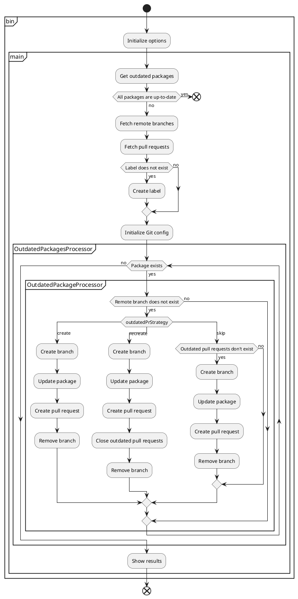

[](https://badge.fury.io/js/npm-update-package)
[](https://github.com/npm-update-package/npm-update-package/actions/workflows/build.yml)
[](https://github.com/npm-update-package/npm-update-package/actions/workflows/lint.yml)
[](https://github.com/npm-update-package/npm-update-package/actions/workflows/test.yml)

# npm-update-package

CLI tool for creating pull requests to update npm packages

## Table of Contents

<!-- START doctoc generated TOC please keep comment here to allow auto update -->
<!-- DON'T EDIT THIS SECTION, INSTEAD RE-RUN doctoc TO UPDATE -->

- [Requirements](#requirements)
- [Supported platforms](#supported-platforms)
- [Usage](#usage)
- [Options](#options)
  - [`--additional-labels`](#--additional-labels)
  - [`--assignees`](#--assignees)
  - [`--assignees-sample-size`](#--assignees-sample-size)
  - [`--commit-message`](#--commit-message)
  - [`--dependency-types`](#--dependency-types)
  - [`--fetch-release-notes`](#--fetch-release-notes)
  - [`--fetch-sleep-time`](#--fetch-sleep-time)
  - [`--git-user-email`](#--git-user-email)
  - [`--git-user-name`](#--git-user-name)
  - [`--github-token`](#--github-token)
  - [`--ignore-packages`](#--ignore-packages)
  - [`--log-level`](#--log-level)
  - [`--outdated-pr-strategy`](#--outdated-pr-strategy)
  - [`--package-manager`](#--package-manager)
  - [`--pr-body-github-host`](#--pr-body-github-host)
  - [`--pr-body-notes`](#--pr-body-notes)
  - [`--pr-title`](#--pr-title)
  - [`--reviewers`](#--reviewers)
  - [`--reviewers-sample-size`](#--reviewers-sample-size)
- [GitHub token](#github-token)
- [How to run on GitHub Actions](#how-to-run-on-github-actions)
  - [Use token of GitHub Actions](#use-token-of-github-actions)
  - [Use token of GitHub App](#use-token-of-github-app)
  - [Use Personal access token](#use-personal-access-token)
- [Architecture](#architecture)
- [FAQ](#faq)
  - [What is the purpose of npm-update-package?](#what-is-the-purpose-of-npm-update-package)
  - [What should I do if conflicts occurred in the pull request?](#what-should-i-do-if-conflicts-occurred-in-the-pull-request)
- [How to development](#how-to-development)

<!-- END doctoc generated TOC please keep comment here to allow auto update -->

## Requirements

- Git
- Node.js v14 or later
- npm or Yarn

## Supported platforms

- GitHub
- GitHub Enterprise

## Usage

```sh
npx npm-update-package --github-token <github-token>
```

## Options

You can customize behavior via CLI options.  
Some options can embed variables like `{{packageName}}`(HTML-escaped) or `{{{packageName}}}`(not HTML-escaped).

### `--additional-labels`

Labels other than `npm-update-package` to add to pull request.

|Name|Value|
|---|---|
|type|string[]|
|required|-|

Example:

```sh
npx npm-update-package \
  --github-token <github-token> \
  --additional-labels bot dependencies
```

### `--assignees`

User names to assign to pull request.

|Name|Value|
|---|---|
|type|string[]|
|required|-|

Example:

```sh
npx npm-update-package \
  --github-token <github-token> \
  --assignees alice bob
```

### `--assignees-sample-size`

How many members to be assigned to assignees.

|Name|Value|
|---|---|
|type|number|
|required|-|

Example:

```sh
npx npm-update-package \
  --github-token <github-token> \
  --assignees alice bob \
  --assignees-sample-size 1
```

### `--commit-message`

Commit message template.

|Name|Value|
|---|---|
|type|string|
|required|-|
|default|`chore(deps): {{{level}}} update {{{packageName}}} to v{{{newVersion}}}`|

Available variables:

|Variable|Description|
|---|---|
|`currentVersion`|Current package version|
|`newVersion`|New package version|
|`packageName`|Package name|
|`level`|Semver level(`major`/`minor`/`patch`)|
|`dependencyType`|Dependency type (`dependencies`/`devDependencies`/`peerDependencies`/`bundledDependencies`/`optionalDependencies`)|

Example:

```sh
npx npm-update-package \
  --github-token <github-token> \
  --commit-message "chore({{{dependencyType}}}): {{{level}}} update {{{packageName}}} from {{{currentVersion}}} to v{{{newVersion}}}"
```

### `--dependency-types`

Dependency types to be updated.

|Name|Value|
|---|---|
|type|string[]|
|required|-|
|default|`dependencies`, `devDependencies`, `peerDependencies`, `bundledDependencies`, `optionalDependencies`|

Allowed values:

|Value|Description|
|---|---|
|`dependencies`|dependencies|
|`devDependencies`|devDependencies|
|`peerDependencies`|peerDependencies|
|`bundledDependencies`|bundledDependencies|
|`optionalDependencies`|optionalDependencies|


Example:

```sh
npx npm-update-package \
  --github-token <github-token> \
  --dependency-types dependencies devDependencies
```

### `--fetch-release-notes`

Whether to fetch release notes.

|Name|Value|
|---|---|
|type|boolean|
|required|-|
|default|`true`|

Example:

```sh
npx npm-update-package \
  --github-token <github-token> \
  --fetch-release-notes false
```

### `--fetch-sleep-time`

Sleep time between fetching (ms).

|Name|Value|
|---|---|
|type|number|
|required|-|
|default|`1000`|

Example:

```sh
npx npm-update-package \
  --github-token <github-token> \
  --fetch-sleep-time 2000
```

### `--git-user-email`

Git user email.

|Name|Value|
|---|---|
|type|string|
|required|-|

Example:

```sh
npx npm-update-package \
  --github-token <github-token> \
  --git-user-email alice@example.com
```

### `--git-user-name`

Git user name.

|Name|Value|
|---|---|
|type|string|
|required|-|

Example:

```sh
npx npm-update-package \
  --github-token <github-token> \
  --git-user-name alice
```

### `--github-token`

[GitHub token](#github-token).

|Name|Value|
|---|---|
|type|string|
|required|✔️|

### `--ignore-packages`

Package names to ignore.

|Name|Value|
|---|---|
|type|string[]|
|required|-|

Example:

```sh
npx npm-update-package \
  --github-token <github-token> \
  --ignore-packages @types/jest jest
```

### `--log-level`

Log level to show.

|Name|Value|
|---|---|
|type|string|
|required|-|
|default|`info`|

Allowed values:

|Value|Description|
|---|---|
|`off`|Do not output any logs.|
|`fatal`|Output fatal logs.|
|`error`|Output fatal/error logs.|
|`warn`|Output fatal/error/warn logs.|
|`info`|Output fatal/error/warn/info logs.|
|`debug`|Output fatal/error/warn/info/debug logs.|
|`trace`|Output fatal/error/warn/info/debug/trace logs.|

Example:

```sh
npx npm-update-package \
  --github-token <github-token> \
  --log-level debug
```

### `--outdated-pr-strategy`

What to do when outdated pull requests exist.

|Name|Value|
|---|---|
|type|string|
|required|-|
|default|`recreate`|

Allowed values:

|Value|Description|
|---|---|
|`create`|Create new pull request.|
|`recreate`|Close outdated pull requests and create new pull request.|
|`skip`|Skip creating pull request.|

Example:

```sh
npx npm-update-package \
  --github-token <github-token> \
  --outdated-pr-strategy create
```

### `--package-manager`

Package manager of your project.  
Since npm-update-package automatically determines which package manager to use, it is usually not necessary to specify this option.

|Name|Value|
|---|---|
|type|string|
|required|-|

Allowed values:

|Value|Description|
|---|---|
|`npm`|Use npm|
|`yarn`|Use Yarn|

Example:

```sh
npx npm-update-package \
  --github-token <github-token> \
  --package-manager yarn
```

### `--pr-body-github-host`

GitHub host of pull request body.

|Name|Value|
|---|---|
|type|string|
|required|-|
|default|`togithub.com`|

Example:

```sh
npx npm-update-package \
  --github-token <github-token> \
  --pr-body-github-host "github.example"
```

### `--pr-body-notes`

Additional notes for Pull request body.

|Name|Value|
|---|---|
|type|string|
|required|-|

Example:

```sh
npx npm-update-package \
  --github-token <github-token> \
  --pr-body-notes "**:warning: Please see diff and release notes before merging.**"
```

### `--pr-title`

Pull request title template.

|Name|Value|
|---|---|
|type|string|
|required|-|
|default|`chore(deps): {{{level}}} update {{{packageName}}} to v{{{newVersion}}}`|

Available variables:

|Variable|Description|
|---|---|
|`currentVersion`|Current package version|
|`newVersion`|New package version|
|`packageName`|Package name|
|`level`|Semver level (`major`/`minor`/`patch`)|
|`dependencyType`|Dependency type (`dependencies`/`devDependencies`/`peerDependencies`/`bundledDependencies`/`optionalDependencies`)|

Example:

```sh
npx npm-update-package \
  --github-token <github-token> \
  --pr-title "chore({{{dependencyType}}}): {{{level}}} update {{{packageName}}} from {{{currentVersion}}} to v{{{newVersion}}}"
```

### `--reviewers`

User names to request reviews.

|Name|Value|
|---|---|
|type|string[]|
|required|-|

Example:

```sh
npx npm-update-package \
  --github-token <github-token> \
  --reviewers alice bob
```

### `--reviewers-sample-size`

How many members to be assigned to reviewers.

|Name|Value|
|---|---|
|type|number|
|required|-|

Example:

```sh
npx npm-update-package \
  --github-token <github-token> \
  --reviewers alice bob \
  --reviewers-sample-size 1
```

## GitHub token

GitHub token is required to run npm-update-package.  
Available tokens and permissions required for each token are as follows.

- [GitHub Actions](https://docs.github.com/en/actions/security-guides/automatic-token-authentication)
- [GitHub App](https://docs.github.com/en/developers/apps/building-github-apps/authenticating-with-github-apps) (recommended)
  - Contents: Read & write
  - Metadata: Read-only
  - Pull requests: Read & write
- [Personal access token](https://docs.github.com/en/authentication/keeping-your-account-and-data-secure/creating-a-personal-access-token)
  - repo

Features of each token are as follows.

||GitHub Actions|GitHub App|Personal access token|
|---|---|---|---|
|Owner of token|GitHub|organization or user|user|
|Author of pull requests|`github-actions`|app|user|
|Trigger other actions|-|✓|✓|

We recommend using GitHub App for the following reasons.

- When you use the token of GitHub Actions, the job will not trigger other actions.
- Personal access token relies on personal account.
- When you use the Personal access token, the author of pull requests will be the user who issued the token.

Creating a GitHub App may be tedious, but you only have to do it once the first time.

## How to run on GitHub Actions

### Use token of GitHub Actions

```yaml
name: npm-update-package
on:
  schedule:
    - cron: '0 0 * * *'
jobs:
  npm-update-package:
    runs-on: ubuntu-latest
    steps:
      - uses: actions/checkout@v2
      - uses: actions/setup-node@v2
      - run: |
          npx npm-update-package \
            --github-token $GITHUB_TOKEN \
            --git-user-name $GIT_USER_NAME \
            --git-user-email $GIT_USER_EMAIL
        env:
          GIT_USER_EMAIL: 41898282+github-actions[bot]@users.noreply.github.com
          GIT_USER_NAME: github-actions[bot]
          GITHUB_TOKEN: ${{ secrets.GITHUB_TOKEN }}
```

See working example on [example-github-actions](https://github.com/npm-update-package/example-github-actions).

### Use token of GitHub App

```yaml
name: npm-update-package
on:
  schedule:
    - cron: '0 0 * * *'
jobs:
  npm-update-package:
    runs-on: ubuntu-latest
    steps:
      - uses: actions/checkout@v2
      - uses: actions/setup-node@v2
      - name: Generate token
        id: generate_token
        uses: tibdex/github-app-token@v1
        with:
          app_id: ${{ secrets.APP_ID }}
          private_key: ${{ secrets.PRIVATE_KEY }}
      - run: |
          npx npm-update-package \
            --github-token $GITHUB_TOKEN \
            --git-user-name $GIT_USER_NAME \
            --git-user-email $GIT_USER_EMAIL
        env:
          # TODO: Replace with your GitHub App's email
          GIT_USER_EMAIL: 97396142+npm-update-package[bot]@users.noreply.github.com
          # TODO: Replace with your GitHub App's user name
          GIT_USER_NAME: npm-update-package[bot]
          GITHUB_TOKEN: ${{ steps.generate_token.outputs.token }}
```

See working example on [example-github-app](https://github.com/npm-update-package/example-github-app).

### Use Personal access token

```yaml
name: npm-update-package
on:
  schedule:
    - cron: '0 0 * * *'
jobs:
  npm-update-package:
    runs-on: ubuntu-latest
    steps:
      - uses: actions/checkout@v2
      - uses: actions/setup-node@v2
      - run: |
          npx npm-update-package \
            --github-token $GITHUB_TOKEN \
            --git-user-name $GIT_USER_NAME \
            --git-user-email $GIT_USER_EMAIL
        env:
          # TODO: Replace with your email
          GIT_USER_EMAIL: 97961304+npm-update-package-bot@users.noreply.github.com
          # TODO: Replace with your name
          GIT_USER_NAME: npm-update-package-bot
          GITHUB_TOKEN: ${{ secrets.PERSONAL_ACCESS_TOKEN }}
```

See working example on [example-pat](https://github.com/npm-update-package/example-pat).

## Architecture

The following shows the process flow of npm-update-package.

<!--

-->

[](http://www.plantuml.com/plantuml/uml/hLD1Rjim4Bpp5NEpV0Xojoyf0ZGeK211Wpw0bjOM4OghagkwwUlhZIYsHAtsaej4xevsECFHNH8RPHgyULkOK-HfnC45i_iKd3ZhtKy2Z-8uf7rk3rRx3oJWIJehr66qxOizqGLYt17D1-zB2JOIfl56-4QnMqXF0SqhfQq1A7I6V28qWRVcidD7OtOVITeUaGOMmY7QqFOwEzV7oNj4-ZPHaeNnipsGHyUK45X0FroIcWgx-qXM25wX-xzOAyKFJj1oEBhJ8lenIttAifuYjvGIHsFElVE49dTcxhI5IuNwweZV4m2LyELFkV-M0gIpKoiQNcR6PubMwFGwzrkhwjetnNEb690PzalrwwWJbllQr-3AxDBJetwl1cN2I9aIxyvvxpbHILmTWlyVBBsuSV51pNwyEWSTXysAvUjorWMjIre_Br2IcVTpFlDgldXJep92ttFMDDCQoummfG7SRjQpZCsjsJttV4QaD7arjlvIVtq5rTL3APgxosCQ_2y0)

## FAQ

### What is the purpose of npm-update-package?

npm-update-package can be used in environments where Renovate cannot be used for some reason.

### What should I do if conflicts occurred in the pull request?

If you have difficulty resolving it manually, close the pull request and run npm-update-package again.

## How to development

See [Wiki](https://github.com/npm-update-package/npm-update-package/wiki).
