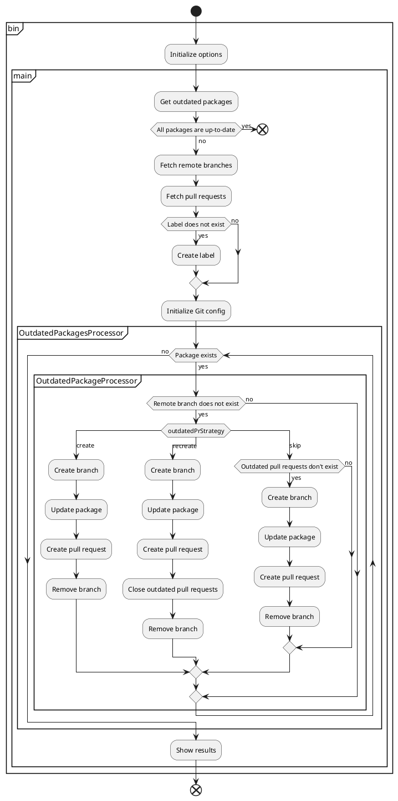

[](https://badge.fury.io/js/npm-update-package)
[](https://standardjs.com)
[](https://github.com/npm-update-package/npm-update-package/actions/workflows/eslint.yml)
[](https://github.com/npm-update-package/npm-update-package/actions/workflows/test.yml)

# npm-update-package

CLI tool for creating pull requests to update npm packages

## Table of Contents

<!-- START doctoc generated TOC please keep comment here to allow auto update -->
<!-- DON'T EDIT THIS SECTION, INSTEAD RE-RUN doctoc TO UPDATE -->

- [Usage](#usage)
- [Requirements](#requirements)
- [Supported platforms](#supported-platforms)
- [Options](#options)
  - [assignees](#assignees)
  - [assigneesSampleSize](#assigneessamplesize)
  - [commitMessage](#commitmessage)
  - [fetchReleaseNotes](#fetchreleasenotes)
  - [fetchSleepTime](#fetchsleeptime)
  - [gitUserEmail](#gituseremail)
  - [gitUserName](#gitusername)
  - [githubToken](#githubtoken)
  - [ignorePackages](#ignorepackages)
  - [logLevel](#loglevel)
  - [outdatedPrStrategy](#outdatedprstrategy)
  - [packageManager](#packagemanager)
  - [prBodyGithubHost](#prbodygithubhost)
  - [prBodyNotes](#prbodynotes)
  - [prTitle](#prtitle)
  - [reviewers](#reviewers)
  - [reviewersSampleSize](#reviewerssamplesize)
- [GitHub token](#github-token)
- [Examples](#examples)
  - [Use token of GitHub Actions](#use-token-of-github-actions)
  - [Use token of GitHub App](#use-token-of-github-app)
  - [Use Personal access token](#use-personal-access-token)
- [Flow](#flow)
- [FAQ](#faq)
  - [What is the purpose of npm-update-package?](#what-is-the-purpose-of-npm-update-package)
  - [What should I do if conflicts occurred in the pull request?](#what-should-i-do-if-conflicts-occurred-in-the-pull-request)
- [How to development](#how-to-development)

<!-- END doctoc generated TOC please keep comment here to allow auto update -->

## Requirements

- Git
- Node.js
- npm or Yarn

## Supported platforms

- GitHub
- GitHub Enterprise

## Usage

```sh
npx npm-update-package --github-token $GITHUB_TOKEN
```

## Options

You can customize behavior via CLI options.  
Some options can embed variables like `{{packageName}}`(HTML-escaped) or `{{{packageName}}}`(not HTML-escaped).

### assignees

User names to assign to pull request.

|Name|Value|
|---|---|
|cli|`--assignees`|
|type|string[]|
|required|false|
|added version|v0.46.0|

Example:

```sh
npx npm-update-package \
  --github-token $GITHUB_TOKEN \
  --assignees alice bob
```

### assigneesSampleSize

How many members to be assigned to assignees.

|Name|Value|
|---|---|
|cli|`--assignees-sample-size`|
|type|number|
|required|false|
|added version|v0.56.0|

Example:

```sh
npx npm-update-package \
  --github-token $GITHUB_TOKEN \
  --assignees alice bob \
  --assignees-sample-size 1
```

### commitMessage

Commit message template.

|Name|Value|
|---|---|
|cli|`--commit-message`|
|type|string|
|required|false|
|default|`chore(deps): {{{level}}} update {{{packageName}}} to v{{{newVersion}}}`|
|added version|v0.5.0|

Available variables:

|Variable|Description|
|---|---|
|`currentVersion`|Current package version|
|`newVersion`|New package version|
|`packageName`|Package name|
|`level`|Semver level (`major`/`minor`/`patch`)|
|`dependencyType`|Dependency type (`dependencies`/`devDependencies`/`peerDependencies`/`optionalDependencies`)|

Example:

```sh
npx npm-update-package \
  --github-token $GITHUB_TOKEN \
  --commit-message "chore({{{dependencyType}}}): {{{level}}} update {{{packageName}}} from {{{currentVersion}}} to v{{{newVersion}}}"
```

### fetchReleaseNotes

Whether to fetch release notes.

|Name|Value|
|---|---|
|cli|`--fetch-release-notes`|
|type|boolean|
|required|false|
|default|`true`|
|added version|v0.51.0|

Example:

```sh
npx npm-update-package \
  --github-token $GITHUB_TOKEN \
  --fetch-release-notes false
```

### fetchSleepTime

Sleep time between fetching (ms).

|Name|Value|
|---|---|
|cli|`--fetch-sleep-time`|
|type|number|
|required|false|
|default|`1000`|
|added version|v0.50.0|

Example:

```sh
npx npm-update-package \
  --github-token $GITHUB_TOKEN \
  --fetch-sleep-time 2000
```

### gitUserEmail

Git user email.

|Name|Value|
|---|---|
|cli|`--git-user-email`|
|type|string|
|required|false|
|added version|v0.53.0|

Example:

```sh
npx npm-update-package \
  --github-token $GITHUB_TOKEN \
  --git-user-email alice@example.com
```

### gitUserName

Git user name.

|Name|Value|
|---|---|
|cli|`--git-user-name`|
|type|string|
|required|false|
|added version|v0.53.0|

Example:

```sh
npx npm-update-package \
  --github-token $GITHUB_TOKEN \
  --git-user-name alice
```

### githubToken

[GitHub token](#github-token).

|Name|Value|
|---|---|
|cli|`--github-token`|
|type|string|
|required|true|
|added version|v0.1.0|

### ignorePackages

Package names to ignore.

|Name|Value|
|---|---|
|cli|`--ignore-packages`|
|type|string[]|
|required|false|
|added version|v0.43.0|

Example:

```sh
npx npm-update-package \
  --github-token $GITHUB_TOKEN \
  --ignore-packages @types/jest jest
```

### logLevel

Log level to show.

|Name|Value|
|---|---|
|cli|`--log-level`|
|type|string|
|required|false|
|default|`info`|
|added version|v0.1.0|

Allowed values:

|Value|Description|
|---|---|
|`off`|Do not output any logs.|
|`fatal`|Output fatal logs.|
|`error`|Output fatal/error logs.|
|`warn`|Output fatal/error/warn logs.|
|`info`|Output fatal/error/warn/info logs.|
|`debug`|Output fatal/error/warn/info/debug logs.|
|`trace`|Output fatal/error/warn/info/debug/trace logs.|

Example:

```sh
npx npm-update-package \
  --github-token $GITHUB_TOKEN \
  --log-level debug
```

### outdatedPrStrategy

What to do when outdated pull requests exist.

|Name|Value|
|---|---|
|cli|`--outdated-pr-strategy`|
|type|string|
|required|false|
|default|`recreate`|
|added version|v0.58.0|

Allowed values:

|Value|Description|
|---|---|
|`create`|Create new pull request.|
|`recreate`|Close outdated pull requests and create new pull request.|
|`skip`|Skip creating pull request.|

Example:

```sh
npx npm-update-package \
  --github-token $GITHUB_TOKEN \
  --outdated-pr-strategy create
```

### packageManager

Package manager of your project.  
Since npm-update-package automatically determines which package manager to use, it is usually not necessary to specify this option.

|Name|Value|
|---|---|
|cli|`--package-manager`|
|type|string|
|required|false|
|added version|v0.1.0|

Allowed values:

|Value|Description|
|---|---|
|`npm`|npm|
|`yarn`|Yarn|

Example:

```sh
npx npm-update-package \
  --github-token $GITHUB_TOKEN \
  --package-manager yarn
```

### prBodyGithubHost

GitHub host of pull request body.

|Name|Value|
|---|---|
|cli|`--pr-body-github-host`|
|type|string|
|required|false|
|default|`togithub.com`|
|added version|v0.55.0|

Example:

```sh
npx npm-update-package \
  --github-token $GITHUB_TOKEN \
  --pr-body-github-host "github.example"
```

### prBodyNotes

Additional notes for Pull request body.

|Name|Value|
|---|---|
|cli|`--pr-body-notes`|
|type|string|
|required|false|
|added version|v0.45.0|

Example:

```sh
npx npm-update-package \
  --github-token $GITHUB_TOKEN \
  --pr-body-notes "**:warning: Please see diff and release notes before merging.**"
```

### prTitle

Pull request title template.

|Name|Value|
|---|---|
|cli|`--pr-title`|
|type|string|
|required|false|
|default|`chore(deps): {{{level}}} update {{{packageName}}} to v{{{newVersion}}}`|
|added version|v0.44.0|

Available variables:

|Variable|Description|
|---|---|
|`currentVersion`|Current package version|
|`newVersion`|New package version|
|`packageName`|Package name|
|`level`|Semver level (`major`/`minor`/`patch`)|
|`dependencyType`|Dependency type (`dependencies`/`devDependencies`/`peerDependencies`/`optionalDependencies`)|

Example:

```sh
npx npm-update-package \
  --github-token $GITHUB_TOKEN \
  --pr-title "chore({{{dependencyType}}}): {{{level}}} update {{{packageName}}} from {{{currentVersion}}} to v{{{newVersion}}}"
```

### reviewers

User names to request reviews.

|Name|Value|
|---|---|
|cli|`--reviewers`|
|type|string[]|
|required|false|
|added version|v0.26.0|

Example:

```sh
npx npm-update-package \
  --github-token $GITHUB_TOKEN \
  --reviewers alice bob
```

### reviewersSampleSize

How many members to be assigned to reviewers.

|Name|Value|
|---|---|
|cli|`--reviewers-sample-size`|
|type|number|
|required|false|
|added version|v0.57.0|

Example:

```sh
npx npm-update-package \
  --github-token $GITHUB_TOKEN \
  --reviewers alice bob \
  --reviewers-sample-size 1
```

## GitHub token

GitHub token is required to run npm-update-package.  
Available tokens and permissions required for each token are as follows.

- [GitHub Actions](https://docs.github.com/en/actions/security-guides/automatic-token-authentication)
- [GitHub App](https://docs.github.com/en/developers/apps/building-github-apps/authenticating-with-github-apps)
  - Contents: Read & write
  - Metadata: Read-only
  - Pull requests: Read & write
- [Personal access token](https://docs.github.com/en/authentication/keeping-your-account-and-data-secure/creating-a-personal-access-token)
  - repo

Features of each token are as follows.

||GitHub Actions|GitHub App|Personal access token|
|---|---|---|---|
|Owner of token|GitHub|organization or user|user|
|Author of pull requests|`github-actions`|app|user|
|Trigger other actions|-|✓|✓|

We recommend using GitHub App for the following reasons.

- When you use the token of GitHub Actions, the job will not trigger other actions.
- Personal access token relies on personal account.
- When you use the Personal access token, the author of pull requests will be the user who issued the token.

Creating a GitHub App may be tedious, but you only have to do it once the first time.

## Examples

### Use token of GitHub Actions

```yaml
name: npm-update-package
on:
  schedule:
    - cron: '0 0 * * *'
jobs:
  npm-update-package:
    runs-on: ubuntu-latest
    steps:
      - uses: actions/checkout@v2
      - uses: actions/setup-node@v2
      - run: |
          npx npm-update-package \
            --github-token $GITHUB_TOKEN \
            --git-user-name $GIT_USER_NAME \
            --git-user-email $GIT_USER_EMAIL
        env:
          GIT_USER_EMAIL: 41898282+github-actions[bot]@users.noreply.github.com
          GIT_USER_NAME: github-actions[bot]
          GITHUB_TOKEN: ${{ secrets.GITHUB_TOKEN }}
```

See working example on [example-github-actions](https://github.com/npm-update-package/example-github-actions).

### Use token of GitHub App

```yaml
name: npm-update-package
on:
  schedule:
    - cron: '0 0 * * *'
jobs:
  npm-update-package:
    runs-on: ubuntu-latest
    steps:
      - uses: actions/checkout@v2
      - uses: actions/setup-node@v2
      - name: Generate token
        id: generate_token
        uses: tibdex/github-app-token@v1
        with:
          app_id: ${{ secrets.APP_ID }}
          private_key: ${{ secrets.PRIVATE_KEY }}
      - run: |
          npx npm-update-package \
            --github-token $GITHUB_TOKEN \
            --git-user-name $GIT_USER_NAME \
            --git-user-email $GIT_USER_EMAIL
        env:
          # TODO: Replace with your GitHub App's email
          GIT_USER_EMAIL: 97396142+npm-update-package[bot]@users.noreply.github.com
          # TODO: Replace with your GitHub App's user name
          GIT_USER_NAME: npm-update-package[bot]
          GITHUB_TOKEN: ${{ steps.generate_token.outputs.token }}
```

See working example on [example-github-app](https://github.com/npm-update-package/example-github-app).

### Use Personal access token

```yaml
name: npm-update-package
on:
  schedule:
    - cron: '0 0 * * *'
jobs:
  npm-update-package:
    runs-on: ubuntu-latest
    steps:
      - uses: actions/checkout@v2
      - uses: actions/setup-node@v2
      - run: |
          npx npm-update-package \
            --github-token $GITHUB_TOKEN \
            --git-user-name $GIT_USER_NAME \
            --git-user-email $GIT_USER_EMAIL
        env:
          # TODO: Replace with your email
          GIT_USER_EMAIL: 97961304+npm-update-package-bot@users.noreply.github.com
          # TODO: Replace with your name
          GIT_USER_NAME: npm-update-package-bot
          GITHUB_TOKEN: ${{ secrets.PERSONAL_ACCESS_TOKEN }}
```

See working example on [example-pat](https://github.com/npm-update-package/example-pat).

## Flow

The following shows the process flow of npm-update-package.

<!--

-->

[](http://www.plantuml.com/plantuml/uml/hLD1Rjim4Bpp5NEpV0Xojoyf0ZGeK211Wpw0bjOM4OghagkwwUlhZIYsHAtsaej4xevsECFHNH8RPHgyULkOK-HfnC45i_iKd3ZhtKy2Z-8uf7rk3rRx3oJWIJehr66qxOizqGLYt17D1-zB2JOIfl56-4QnMqXF0SqhfQq1A7I6V28qWRVcidD7OtOVITeUaGOMmY7QqFOwEzV7oNj4-ZPHaeNnipsGHyUK45X0FroIcWgx-qXM25wX-xzOAyKFJj1oEBhJ8lenIttAifuYjvGIHsFElVE49dTcxhI5IuNwweZV4m2LyELFkV-M0gIpKoiQNcR6PubMwFGwzrkhwjetnNEb690PzalrwwWJbllQr-3AxDBJetwl1cN2I9aIxyvvxpbHILmTWlyVBBsuSV51pNwyEWSTXysAvUjorWMjIre_Br2IcVTpFlDgldXJep92ttFMDDCQoummfG7SRjQpZCsjsJttV4QaD7arjlvIVtq5rTL3APgxosCQ_2y0)

## FAQ

### What is the purpose of npm-update-package?

npm-update-package can be used in environments where Renovate cannot be used for some reason.

### What should I do if conflicts occurred in the pull request?

If you have difficulty resolving it manually, close the pull request and run npm-update-package again.

## How to development

See [Wiki](https://github.com/npm-update-package/npm-update-package/wiki).
