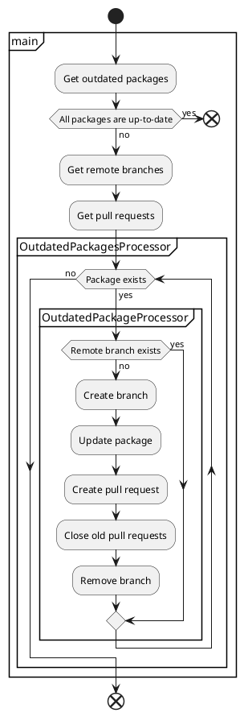

[](https://badge.fury.io/js/npm-update-package)
[](https://standardjs.com)

# npm-update-package

CLI tool for creating pull requests to update npm packages

## Usage

```sh
npx npm-update-package --github-token $GITHUB_TOKEN
```

## Options

You can customize behavior via command-line options.  
Some options can embed variables like `{{packageName}}`(HTML-escaped) or `{{{packageName}}}`(not HTML-escaped).

### `--commit-message`

Commit message template

- type: string
- required: false
- variables
  - `currentVersion`: current package version
  - `newVersion`: new package version
  - `packageName`: package name
  - `level`: semver level (major/minor/patch)
- default: `chore(deps): {{level}} update {{{packageName}}} to v{{newVersion}}`

### `--github-token`

[GitHub token](#github-token)

- type: string
- required: true

### `--log-level`

Log level to show

- type: string
- required: false
- allowed values
  - `off`: Do not output any logs.
  - `error`: Output error logs.
  - `info`: Output error/info logs.
  - `debug`: Output error/info/debug logs.
- default: `info`

### `--package-manager`

Package manager of your project

- type: string
- required: false
- allowed values
  - `npm`: npm
  - `yarn`: Yarn
- default: `npm`

### `--pull-request-title`

Pull request title template

- type: string
- required: false
- variables
  - `currentVersion`: current package version
  - `newVersion`: new package version
  - `packageName`: package name
  - `level`: semver level (major/minor/patch)
- default: `chore(deps): {{level}} update {{{packageName}}} to v{{newVersion}}`

## GitHub token

GitHub token is required to run npm-update-package.  
Available tokens and permissions required for each token are as follows.

- [GitHub Actions](https://docs.github.com/en/actions/security-guides/automatic-token-authentication)
- [GitHub App](https://docs.github.com/en/developers/apps/building-github-apps/authenticating-with-github-apps)
  - Contents: Read & write
  - Metadata: Read-only
  - Pull requests: Read & write
- [Personal access token](https://docs.github.com/en/authentication/keeping-your-account-and-data-secure/creating-a-personal-access-token)
  - repo

Features of each token are as follows.

||GitHub Actions|GitHub App|Personal access token|
|---|---|---|---|
|Owner of token|GitHub|organization or user|user|
|Author of pull requests|`github-actions`|app|user|
|Trigger other actions|-|✓|✓|

We recommend using GitHub App for the following reasons.

- When you use the token of GitHub Actions, the job will not trigger other actions.
- Personal access token relies on personal account.
- When you use the Personal access token, the author of pull requests will be the user who issued the token.

Creating a GitHub App may be tedious, but you only have to do it once the first time.

## Examples

- [Use token of GitHub Actions](https://github.com/npm-update-package/example-github-actions)

```yaml
name: npm-update-package
on:
  schedule:
    - cron: '0 0 * * *'
jobs:
  npm-update-package:
    runs-on: ubuntu-latest
    steps:
      - uses: actions/checkout@v2
      - uses: actions/setup-node@v2
      - run: |
          git config user.name $GIT_USER_NAME
          git config user.email $GIT_USER_EMAIL
          npx npm-update-package --github-token $GITHUB_TOKEN
        env:
          GIT_USER_EMAIL: 41898282+github-actions[bot]@users.noreply.github.com
          GIT_USER_NAME: github-actions[bot]
          GITHUB_TOKEN: ${{ secrets.GITHUB_TOKEN }}
```

- [Use token of GitHub App](https://github.com/npm-update-package/example-github-app)

```yaml
name: npm-update-package
on:
  schedule:
    - cron: '0 0 * * *'
jobs:
  npm-update-package:
    runs-on: ubuntu-latest
    steps:
      - uses: actions/checkout@v2
      - uses: actions/setup-node@v2
      - name: Generate token
        id: generate_token
        uses: tibdex/github-app-token@v1
        with:
          app_id: ${{ secrets.APP_ID }}
          private_key: ${{ secrets.PRIVATE_KEY }}
      - run: |
          git config user.name $GIT_USER_NAME
          git config user.email $GIT_USER_EMAIL
          npx npm-update-package --github-token $GITHUB_TOKEN
        env:
          # TODO: Replace with your GitHub App's email
          GIT_USER_EMAIL: 97396142+npm-update-package-bot[bot]@users.noreply.github.com
          # TODO: Replace with your GitHub App's user name
          GIT_USER_NAME: npm-update-package-bot[bot]
          GITHUB_TOKEN: ${{ steps.generate_token.outputs.token }}
```

- [Use Personal access token](https://github.com/npm-update-package/example-pat)

```yaml
name: npm-update-package
on:
  schedule:
    - cron: '0 0 * * *'
jobs:
  npm-update-package:
    runs-on: ubuntu-latest
    steps:
      - uses: actions/checkout@v2
      - uses: actions/setup-node@v2
      - run: |
          git config user.name $GIT_USER_NAME
          git config user.email $GIT_USER_EMAIL
          npx npm-update-package --github-token $GITHUB_TOKEN
        env:
          # TODO: Replace with your email
          GIT_USER_EMAIL: 97961304+npm-update-package-bot@users.noreply.github.com
          # TODO: Replace with your name
          GIT_USER_NAME: npm-update-package-bot
          GITHUB_TOKEN: ${{ secrets.PERSONAL_ACCESS_TOKEN }}
```

- [Use Yarn](https://github.com/npm-update-package/example-yarn)

```yaml
name: npm-update-package
on:
  schedule:
    - cron: '0 0 * * *'
jobs:
  npm-update-package:
    runs-on: ubuntu-latest
    steps:
      - uses: actions/checkout@v2
      - uses: actions/setup-node@v2
      - name: Generate token
        id: generate_token
        uses: tibdex/github-app-token@v1
        with:
          app_id: ${{ secrets.APP_ID }}
          private_key: ${{ secrets.PRIVATE_KEY }}
      - run: |
          git config user.name $GIT_USER_NAME
          git config user.email $GIT_USER_EMAIL
          npx npm-update-package --github-token $GITHUB_TOKEN --package-manager yarn
        env:
          # TODO: Replace with your GitHub App's email
          GIT_USER_EMAIL: 97396142+npm-update-package-bot[bot]@users.noreply.github.com
          # TODO: Replace with your GitHub App's user name
          GIT_USER_NAME: npm-update-package-bot[bot]
          GITHUB_TOKEN: ${{ steps.generate_token.outputs.token }}
```

## Flow

The following shows the process flow of npm-update-package.

<!--

-->

[](http://www.plantuml.com/plantuml/uml/RL0vSiCm3EpnYYsbmX-m6cTIf8mdCta08y4M9n39yCZn-uYYJ4kPD3omm1uuXQXyJ9FGyg2hjybXKjhGyOaZR8g3YZp0gVvTNJbqHFg2va6abg0y8xb3j8VSsoAERD3yS6W9O3CGIs0qnhOq__I52hVdoKR6crUc7sVcKdL919u_4eUOrOgZvzN7UTKyUzjp2DRJrwY5qQm0-5lFSorqg0x-PRWJ03dGozPCPTadgIa0uFZeMTM9hjHUNTQuRQRRDkw2tH2nWM5b-9EweDdIvrPWMLwvIwYypf9_iKLtW7OzT9gFDCal)

## FAQ

### What is the purpose of npm-update-package?

npm-update-package can be used in environments where Renovate cannot be used for some reason.

### Conflicts have occurred in the pull request. What should I do?

If conflicts have occurred in the pull request, close it and run npm-update-package again.
