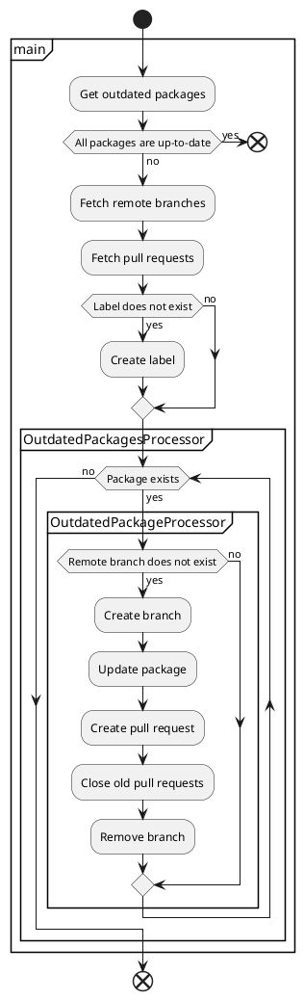

[](https://badge.fury.io/js/npm-update-package)
[](https://standardjs.com)
[](https://github.com/npm-update-package/npm-update-package/actions/workflows/eslint.yml)
[](https://github.com/npm-update-package/npm-update-package/actions/workflows/test.yml)

# npm-update-package

CLI tool for creating pull requests to update npm packages

## Table of Contents

<!-- START doctoc generated TOC please keep comment here to allow auto update -->
<!-- DON'T EDIT THIS SECTION, INSTEAD RE-RUN doctoc TO UPDATE -->

- [Usage](#usage)
- [Options](#options)
  - [`--assignees`](#--assignees)
  - [`--commit-message`](#--commit-message)
  - [`--fetch-release-notes`](#--fetch-release-notes)
  - [`--fetch-sleep-time`](#--fetch-sleep-time)
  - [`--github-token`](#--github-token)
  - [`--ignore-packages`](#--ignore-packages)
  - [`--log-level`](#--log-level)
  - [`--package-manager`](#--package-manager)
  - [`--pr-body-notes`](#--pr-body-notes)
  - [`--pr-title`](#--pr-title)
  - [`--reviewers`](#--reviewers)
- [GitHub token](#github-token)
- [Examples](#examples)
- [Flow](#flow)
- [FAQ](#faq)
  - [What is the purpose of npm-update-package?](#what-is-the-purpose-of-npm-update-package)
  - [What should I do if conflicts occurred in the pull request?](#what-should-i-do-if-conflicts-occurred-in-the-pull-request)
- [How to development](#how-to-development)

<!-- END doctoc generated TOC please keep comment here to allow auto update -->

## Usage

```sh
npx npm-update-package --github-token $GITHUB_TOKEN
```

## Options

You can customize behavior via command-line options.  
Some options can embed variables like `{{packageName}}`(HTML-escaped) or `{{{packageName}}}`(not HTML-escaped).

### `--assignees`

User names to assign to pull request.

|Name|Value|
|---|---|
|type|string[]|
|required|false|

Example:

```sh
npx npm-update-package \
  --github-token $GITHUB_TOKEN \
  --assignees octocat mona
```

### `--commit-message`

Commit message template.

|Name|Value|
|---|---|
|type|string|
|required|false|
|default|`chore(deps): {{{level}}} update {{{packageName}}} to v{{{newVersion}}}`|

Available variables:

|Variable|Description|
|---|---|
|`currentVersion`|Current package version|
|`newVersion`|New package version|
|`packageName`|Package name|
|`level`|Semver level (`major`/`minor`/`patch`)|
|`dependencyType`|Dependency type (`dependencies`/`devDependencies`/`peerDependencies`/`optionalDependencies`)|

Example:

```sh
npx npm-update-package \
  --github-token $GITHUB_TOKEN \
  --commit-message "chore({{{dependencyType}}}): {{{level}}} update {{{packageName}}} from {{{currentVersion}}} to v{{{newVersion}}}"
```

### `--fetch-release-notes`

Whether to fetch release notes.

|Name|Value|
|---|---|
|type|boolean|
|required|false|
|default|`true`|

Example:

```sh
npx npm-update-package \
  --github-token $GITHUB_TOKEN \
  --fetch-release-notes false
```

### `--fetch-sleep-time`

Sleep time between fetching (ms).

|Name|Value|
|---|---|
|type|number|
|required|false|
|default|`1000`|

Example:

```sh
npx npm-update-package \
  --github-token $GITHUB_TOKEN \
  --fetch-sleep-time 2000
```

### `--github-token`

[GitHub token](#github-token).

|Name|Value|
|---|---|
|type|string|
|required|true|

### `--ignore-packages`

Package names to ignore.

|Name|Value|
|---|---|
|type|string[]|
|required|false|

Example:

```sh
npx npm-update-package \
  --github-token $GITHUB_TOKEN \
  --ignore-packages @types/jest jest
```

### `--log-level`

Log level to show.

|Name|Value|
|---|---|
|type|string|
|required|false|
|default|`info`|

Allowed values:

|Value|Description|
|---|---|
|`off`|Do not output any logs.|
|`fatal`|Output fatal logs.|
|`error`|Output fatal/error logs.|
|`warn`|Output fatal/error/warn logs.|
|`info`|Output fatal/error/warn/info logs.|
|`debug`|Output fatal/error/warn/info/debug logs.|
|`trace`|Output fatal/error/warn/info/debug/trace logs.|

Example:

```sh
npx npm-update-package \
  --github-token $GITHUB_TOKEN \
  --log-level debug
```

### `--package-manager`

Package manager of your project.

|Name|Value|
|---|---|
|type|string|
|required|false|
|default|`npm`|

Allowed values:

|Value|Description|
|---|---|
|`npm`|npm|
|`yarn`|Yarn|

Example:

```sh
npx npm-update-package \
  --github-token $GITHUB_TOKEN \
  --package-manager yarn
```

### `--pr-body-notes`

Additional notes for Pull request body.

|Name|Value|
|---|---|
|type|string|
|required|false|

Example:

```sh
npx npm-update-package \
  --github-token $GITHUB_TOKEN \
  --pr-body-notes "**:warning: Please see diff and release notes before merging.**"
```

### `--pr-title`

Pull request title template.

|Name|Value|
|---|---|
|type|string|
|required|false|
|default|`chore(deps): {{{level}}} update {{{packageName}}} to v{{{newVersion}}}`|

Available variables:

|Variable|Description|
|---|---|
|`currentVersion`|Current package version|
|`newVersion`|New package version|
|`packageName`|Package name|
|`level`|Semver level (`major`/`minor`/`patch`)|
|`dependencyType`|Dependency type (`dependencies`/`devDependencies`/`peerDependencies`/`optionalDependencies`)|

Example:

```sh
npx npm-update-package \
  --github-token $GITHUB_TOKEN \
  --pr-title "chore({{{dependencyType}}}): {{{level}}} update {{{packageName}}} from {{{currentVersion}}} to v{{{newVersion}}}"
```

### `--reviewers`

User names to request reviews.

|Name|Value|
|---|---|
|type|string[]|
|required|false|

Example:

```sh
npx npm-update-package \
  --github-token $GITHUB_TOKEN \
  --reviewers octocat mona
```

## GitHub token

GitHub token is required to run npm-update-package.  
Available tokens and permissions required for each token are as follows.

- [GitHub Actions](https://docs.github.com/en/actions/security-guides/automatic-token-authentication)
- [GitHub App](https://docs.github.com/en/developers/apps/building-github-apps/authenticating-with-github-apps)
  - Contents: Read & write
  - Metadata: Read-only
  - Pull requests: Read & write
- [Personal access token](https://docs.github.com/en/authentication/keeping-your-account-and-data-secure/creating-a-personal-access-token)
  - repo

Features of each token are as follows.

||GitHub Actions|GitHub App|Personal access token|
|---|---|---|---|
|Owner of token|GitHub|organization or user|user|
|Author of pull requests|`github-actions`|app|user|
|Trigger other actions|-|✓|✓|

We recommend using GitHub App for the following reasons.

- When you use the token of GitHub Actions, the job will not trigger other actions.
- Personal access token relies on personal account.
- When you use the Personal access token, the author of pull requests will be the user who issued the token.

Creating a GitHub App may be tedious, but you only have to do it once the first time.

## Examples

- [Use token of GitHub Actions](https://github.com/npm-update-package/example-github-actions)

```yaml
name: npm-update-package
on:
  schedule:
    - cron: '0 0 * * *'
jobs:
  npm-update-package:
    runs-on: ubuntu-latest
    steps:
      - uses: actions/checkout@v2
      - uses: actions/setup-node@v2
      - run: |
          git config user.name $GIT_USER_NAME
          git config user.email $GIT_USER_EMAIL
          npx npm-update-package --github-token $GITHUB_TOKEN
        env:
          GIT_USER_EMAIL: 41898282+github-actions[bot]@users.noreply.github.com
          GIT_USER_NAME: github-actions[bot]
          GITHUB_TOKEN: ${{ secrets.GITHUB_TOKEN }}
```

- [Use token of GitHub App](https://github.com/npm-update-package/example-github-app)

```yaml
name: npm-update-package
on:
  schedule:
    - cron: '0 0 * * *'
jobs:
  npm-update-package:
    runs-on: ubuntu-latest
    steps:
      - uses: actions/checkout@v2
      - uses: actions/setup-node@v2
      - name: Generate token
        id: generate_token
        uses: tibdex/github-app-token@v1
        with:
          app_id: ${{ secrets.APP_ID }}
          private_key: ${{ secrets.PRIVATE_KEY }}
      - run: |
          git config user.name $GIT_USER_NAME
          git config user.email $GIT_USER_EMAIL
          npx npm-update-package --github-token $GITHUB_TOKEN
        env:
          # TODO: Replace with your GitHub App's email
          GIT_USER_EMAIL: 97396142+npm-update-package[bot]@users.noreply.github.com
          # TODO: Replace with your GitHub App's user name
          GIT_USER_NAME: npm-update-package[bot]
          GITHUB_TOKEN: ${{ steps.generate_token.outputs.token }}
```

- [Use Personal access token](https://github.com/npm-update-package/example-pat)

```yaml
name: npm-update-package
on:
  schedule:
    - cron: '0 0 * * *'
jobs:
  npm-update-package:
    runs-on: ubuntu-latest
    steps:
      - uses: actions/checkout@v2
      - uses: actions/setup-node@v2
      - run: |
          git config user.name $GIT_USER_NAME
          git config user.email $GIT_USER_EMAIL
          npx npm-update-package --github-token $GITHUB_TOKEN
        env:
          # TODO: Replace with your email
          GIT_USER_EMAIL: 97961304+npm-update-package-bot@users.noreply.github.com
          # TODO: Replace with your name
          GIT_USER_NAME: npm-update-package-bot
          GITHUB_TOKEN: ${{ secrets.PERSONAL_ACCESS_TOKEN }}
```

- [Use Yarn](https://github.com/npm-update-package/example-yarn)

```yaml
name: npm-update-package
on:
  schedule:
    - cron: '0 0 * * *'
jobs:
  npm-update-package:
    runs-on: ubuntu-latest
    steps:
      - uses: actions/checkout@v2
      - uses: actions/setup-node@v2
      - name: Generate token
        id: generate_token
        uses: tibdex/github-app-token@v1
        with:
          app_id: ${{ secrets.APP_ID }}
          private_key: ${{ secrets.PRIVATE_KEY }}
      - run: |
          git config user.name $GIT_USER_NAME
          git config user.email $GIT_USER_EMAIL
          npx npm-update-package --github-token $GITHUB_TOKEN --package-manager yarn
        env:
          # TODO: Replace with your GitHub App's email
          GIT_USER_EMAIL: 97396142+npm-update-package[bot]@users.noreply.github.com
          # TODO: Replace with your GitHub App's user name
          GIT_USER_NAME: npm-update-package[bot]
          GITHUB_TOKEN: ${{ steps.generate_token.outputs.token }}
```

## Flow

The following shows the process flow of npm-update-package.

<!--

-->

[](http://www.plantuml.com/plantuml/uml/VL1BJiCm4DtFATuoMVG2pQO82JP8L4WSm4scJSGa3fundzjJrqsJ5iJ6dtbFypuRDHSizaAd1ns2ZoDwrmsqVcI3ZzOuumQZgz_SWRKYwlOexaGk8xZ0YEFA_2fnIrZB0uflrf807XfYKKOn-9AElsvFj7vWgri4xhqnTi4DTSjQJVCnYY3mUsIrIV79xLZGU5OCti1VdTgDrFe-i3E696hrMpM7Upv7sfxjRuElMTK7-cmxOHHd84jeYKul2dzkc1S0oUdBCjN_ZcVFcLtbsUkOzay5LrV4PJSJ8buPNfgRuZAQx7mi1UPUW5Cp-SxXKbUd7ZA3Pe2kEBGv7h6N7m00)

## FAQ

### What is the purpose of npm-update-package?

npm-update-package can be used in environments where Renovate cannot be used for some reason.

### What should I do if conflicts occurred in the pull request?

If you have difficulty resolving it manually, close the pull request and run npm-update-package again.

## How to development

See [Wiki](https://github.com/npm-update-package/npm-update-package/wiki).
