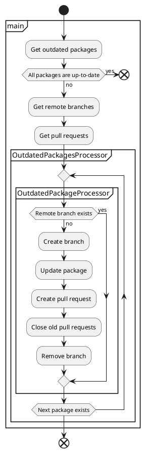

[](https://badge.fury.io/js/npm-update-package)
[](https://standardjs.com)

# npm-update-package

CLI tool for creating pull request to update npm packages

## Usage

```sh
npx npm-update-package --github-token $GITHUB_TOKEN
```

## Options

You can customize behavior via command-line options.  
Template strings such as `--commit-message` can embed variables like `{{packageName}}`(HTML-escaped) or `{{{packageName}}}`(not HTML-escaped).

### `--commit-message`

Commit message template

- type: string
- variables:
  - `currentVersion`
  - `newVersion`
  - `packageName`
  - `updateType`
- required: false
- default: `chore(deps): {{updateType}} update {{{packageName}}} to v{{newVersion}}`

### `--github-token`

GitHub token

- type: string
- required: true

### `--log-level`

Log level to show

- type: string
- allowed values:
  - `off`: Do not output any logs.
  - `error`: Output error logs.
  - `info`: Output error/info logs.
  - `debug`: Output error/info/debug logs.
- required: false
- default: `info`

### `--package-manager`

Package manager of your project

- type: string
- allowed values:
  - `npm`
  - `yarn`
- required: false
- default: `npm`

### `--pull-request-title`

Pull request title template

- type: string
- variables:
  - `currentVersion`
  - `newVersion`
  - `packageName`
  - `updateType`
- required: false
- default: `chore(deps): {{updateType}} update {{{packageName}}} to v{{newVersion}}`

## Examples

Example of running npm-update-package on GitHub Actions at 0:00 (UTC) every day:

```yaml
name: npm-update-package
on:
  schedule:
    - cron: '0 0 * * *'
jobs:
  npm-update-package:
    runs-on: ubuntu-latest
    steps:
      - uses: actions/checkout@v2
      - uses: actions/setup-node@v2
      - run: |
          git config user.name $GIT_USER_NAME
          git config user.email $GIT_USER_EMAIL
          npx npm-update-package --github-token $GITHUB_TOKEN
        env:
          GIT_USER_EMAIL: 41898282+github-actions[bot]@users.noreply.github.com
          GIT_USER_NAME: github-actions[bot]
          GITHUB_TOKEN: ${{ secrets.GITHUB_TOKEN }}
```

Actual working examples can be seen in these repositories.

- [npm-update-package/example-npm](https://github.com/npm-update-package/example-npm)

## Flow

The following shows the process flow of npm-update-package:

<!--

-->

[](http://www.plantuml.com/plantuml/uml/RL0nKiCm4Epl5LlQHJuGDs4ew23330yGzYRs85j2Ea7uFNPanoP38vtsLhUxTuXgWgRUohMGSt39epVT8FidAbpInYWRU5D_c3DZ9TATK3nOUuDW0f7yJjrkufRGbWEA7yPI00wDq4QY65mfuwixIPuTs3ibteCPwdQSd56Vh4NWPsBK4PiTlSm-ZhFcCRYQCReWWPv61VYNkFA0oVVhLXEyTAF8dU7LB03i7mFDxKULiJS_QImBgBR4F_wNZdMHSBQv2vUxawMlhS1rH_dEeUQC-6uxInJFlEYYlKIGbRoMKoM7yKYz_GK0)

## FAQ

### What is the purpose of npm-update-package?

npm-update-package can be used in environments where Renovate cannot be used for some reason.

### Conflicts have occurred in PR. What should I do?

If conflicts have occurred in PR, close it and run npm-update-package again.
